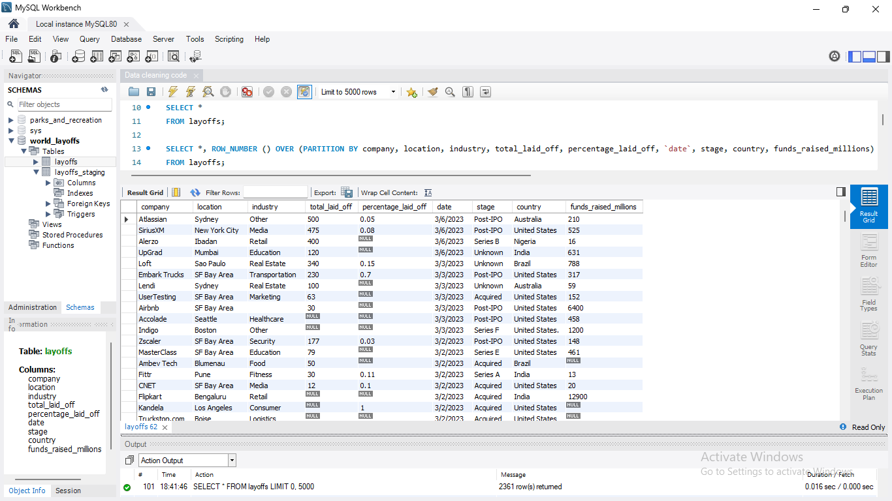
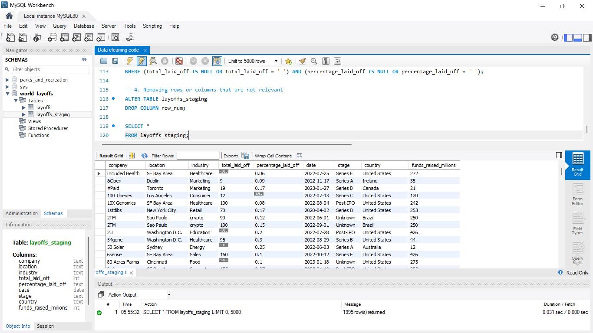

# 🌍 World Layoffs: Data Cleaning & Transformation Project

## 📖 Table of Contents
* [Project Overview](#-project-overview)
* [Data Preview](#%EF%B8%8F-data-preview)
* [Data Cleaning Workflow](#%EF%B8%8F-data-cleaning-workflow)
    * [1. Duplicate Removal](#1-duplicate-removal)
    * [2. Data Standardization](#2-data-standardization)
    * [3. Date Conversion](#3-date-conversion)
    * [4. Handling Nulls](#4-handling-nulls)
* [Technical Skills](#-technical-skills-highlighted)

## 📌 Project Overview
This project involves a deep dive into the **World Layoffs** dataset to transform raw, unorganized data into a clean, analysis-ready format. The objective was to follow a rigorous data cleaning workflow to ensure accuracy and consistency across thousands of records.

## 🖼️ Data Preview

### Raw Data (Before Cleaning)
*Initial state of the `layoffs` table with duplicates and unformatted dates.*

### Cleaned Data (Final Output)
*The `layoffs_staging` table after standardization, null removal, and type casting.*

# 🌍 World Layoffs: Data Cleaning & Transformation Project

## 🛠️ Data Cleaning Workflow
I followed a structured 4-step process to clean the dataset:

### 1. Duplicate Removal
* **Identification:** Utilized **CTEs** and the `ROW_NUMBER()` window function to identify redundant records.
* **Staging:** Created a `layoffs_staging` table to ensure data safety and preserve the original dataset while performing deletions.

### 2. Data Standardization
* **Text Processing:** Used the `TRIM()` function on all major columns to remove unnecessary whitespace.
* **Industry Consolidation:** Normalized industry names (e.g., merging all 'Crypto' variants like *CryptoCurrency* into one single 'Crypto' category).
* **Geographical Accuracy:** Cleaned up inconsistencies in the `country` column, specifically fixing trailing punctuation in the *'United States'* entries.

### 3. Date Conversion
* **String to Date:** Converted the `date` column from a `TEXT` string to a proper `DATE` format using `STR_TO_DATE()`.
* **Schema Modification:** Used `ALTER TABLE` to permanently change the column type, enabling future time-series analysis and forecasting.

### 4. Handling Nulls & Irrelevant Data
* **Filtering:** Identified and removed records where both `total_laid_off` and `percentage_laid_off` were null, as they lacked actionable data.
* **Cleanup:** Dropped helper columns (like `row_num`) used during the cleaning process to keep the final output lean and professional.

---

## 🚀 Technical Skills Highlighted
* **Window Functions:** `ROW_NUMBER() OVER(PARTITION BY...)`
* **CTEs (Common Table Expressions):** For complex filtering and row identification.
* **DML (Data Manipulation Language):** Advanced `UPDATE` and `DELETE` operations.
* **DDL (Data Definition Language):** Schema optimization with `ALTER TABLE` and `MODIFY COLUMN`.

---

## 📈 Conclusion
The final dataset is now optimized for **Exploratory Data Analysis (EDA)**. By applying these SQL techniques, I reduced noise and improved the reliability of the data for data-driven decision-making.
